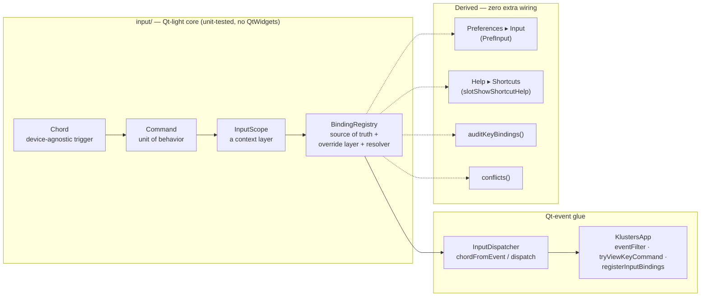
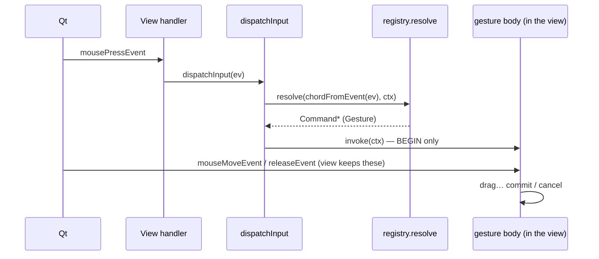
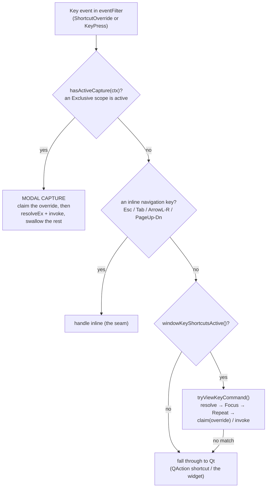
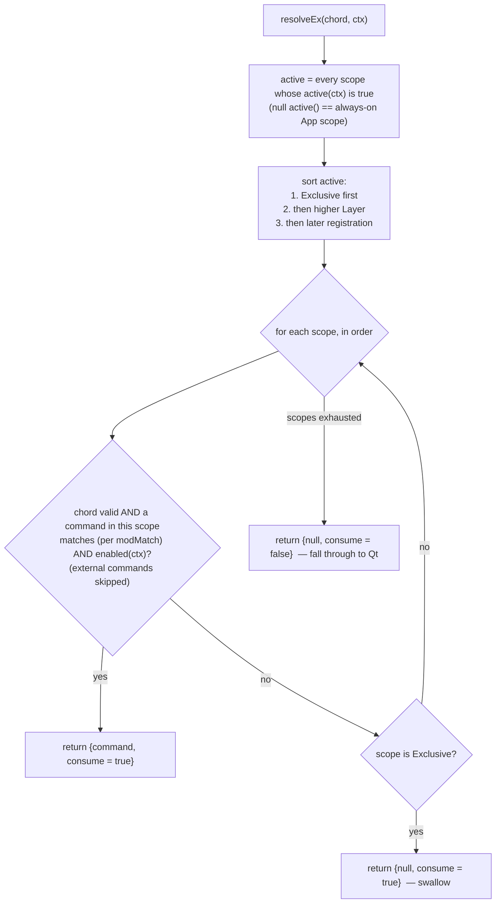

# The Klusters input system

A developer reference for the keyboard + mouse binding architecture in
`src/klusters/src/input/`. Read this before modifying or extending input
handling — adding a view, a tool mode, a modal preview, or a new rebindable
shortcut.

> **Companion documents.** `claude/input-remapping-plan.md` is the design
> rationale and the migration history (why the architecture is shaped this way,
> and the patch-by-patch record of moving the old `eventFilter` onto it). *This*
> document is the living reference for the system as it stands. When they
> disagree, the code wins; fix this doc.

---

## 1. Why this exists

Before this system, adding a view or a behavior mode to Klusters meant editing
`klusters.cpp` (action creation **plus** a new branch in a 700-line
`eventFilter` **plus** mode slots), the view's own hardcoded `keyPressEvent` /
`mousePressEvent`, **and** the Preferences dialog — scattered edits that were
easy to get wrong and that silently shadowed each other (a key bound in two
places, a QAction that could never fire because the filter ate its key first).

The design goal is **locality of change**:

> A view or mode declares its commands and default bindings in **one place**.
> The resolver, Preferences page, persistence, conflict-checker, cheat-sheet and
> startup audit all **discover** them. No edits anywhere else.

Keyboard and mouse are deliberately **one mechanism** — a mouse button is just a
`Chord` with `device == Button`, so binding, resolving, persistence and conflict
detection treat them identically.

---

## 2. The pieces at a glance



| File | Role |
|------|------|
| `input/chord.h/.cpp` | `Chord` — a device-agnostic trigger (key / button / wheel + modifiers). |
| `input/command.h` | `Command` — one unit of behavior; what a chord resolves to. |
| `input/inputscope.h` | `InputScope` — a view or mode expressed as a self-describing context layer. |
| `input/ctx.h` | `Ctx` — the `{view, event}` passed to every predicate and `invoke()`. |
| `input/bindingregistry.h/.cpp` | The one registry: storage, override layer, and the resolver (`resolveEx`). |
| `input/inputdispatcher.h/.cpp` | Qt-event glue: `chordFromEvent()`, `registry()`, `dispatch()`. |
| `input/keymapprofile.h/.cpp` | Saveable/shippable named binding layouts. |
| `klusters.cpp` | `registerInputBindings()` (all the app's scopes + commands), the `eventFilter` dispatch paths, `tryViewKeyCommand()`. |
| `prefinput.cpp` | The generated Preferences ▸ Input page. |

The `input/` core pulls **no QtWidgets** headers (only `QWidget`/`QEvent`
forward-declared pointers), so it is unit-tested standalone by
`klusters_test_bindingregistry` and `klusters_test_inputdispatcher`.

---

## 3. The five core types

### 3.1 `Chord` — the trigger

A `Chord` names only the **press** (or double-click, or wheel notch) that
*begins* an interaction. A drag / move / release is **not** a chord — that is
the gesture body, which lives in the view (see [the seam](#7-the-seam)).

```cpp
struct Chord {
    Device   device  = Device::None;   // None | Key | Button | Wheel
    int      code    = 0;              // Qt::Key_* | a Qt::MouseButton | wheel dir (+1 up / -1 down)
    Qt::KeyboardModifiers modifiers = Qt::NoModifier;
    Phase    phase    = Phase::Press;  // Press | DoubleClick | Wheel
    ModMatch modMatch = ModMatch::Exact;
};
```

**`ModMatch` is the subtle one.** A binding is matched against a concrete event
chord by `Chord::matches()`:

| `modMatch` | Matches when… | Use for |
|------------|---------------|---------|
| `Exact` (default) | event modifiers **==** binding modifiers | key shortcuts — `Ctrl+S` means `Ctrl+S`, not `Ctrl+Shift+S` |
| `AtLeast` | event carries **at least** the binding's modifiers (extras OK): `(e.mods & mods) == mods` | mouse gestures and swallow-all modal keys — e.g. base rubber-band zoom = Left with *any* modifiers (`AtLeast + NoModifier`); Ctrl-pan = `AtLeast + Ctrl` |

Only the four "interesting" modifiers (Shift/Ctrl/Alt/Meta) participate;
`normalize()` masks Keypad/GroupSwitch so a numpad Enter or an X11 group-switch
never changes resolution.

Builders keep registration sites readable: `Chord::key(code, mods)` (always
`Exact`), `Chord::button(btn, mods, phase, mm)`, `Chord::wheel(dir, mods, mm)`.
For an `AtLeast` key chord, construct the aggregate directly:

```cpp
input::Chord{ input::Device::Key, Qt::Key_Left, Qt::NoModifier,
              input::Phase::Press, input::ModMatch::AtLeast };
```

`toString()`/`fromString()` are an exact integer round-trip (persistence —
**only user overrides are stored**). `displayString()` is a one-way
human-readable label for the UI ("Ctrl+Shift+S", "Right-button", "Ctrl+Wheel
up"); it does **not** round-trip.

### 3.2 `Command` — the unit of behavior

```cpp
struct Command {
    QString id;        // globally unique: "cluster.lasso", "ws.sigmaUp", "app.prefs"
    QString scopeId;   // the InputScope that owns it
    QString label;     // shown in Preferences + cheat-sheet (caller tr()'s it)
    QString category;  // grouping within the page

    Kind   kind   = Kind::Action;        // Action | Gesture | Locked
    Focus  focus  = Focus::Default;      // Default | Always   (keys only)
    Repeat repeat = Repeat::FallThrough; // FallThrough | Fire (keys only)
    Chord  defaultChord;

    bool   external = false;             // a QAction Qt already dispatches (see below)

    std::function<bool(const Ctx&)> enabled;  // "when" predicate; null == always
    std::function<void(const Ctx&)> invoke;   // Action: perform; Gesture: BEGIN
};
```

A command is declared **next to the code it drives** (a view's / mode's
registration), never in a central table — that locality is the whole point.

**`Kind`**

| Kind | `invoke()` does | Rebindable? | Example |
|------|-----------------|-------------|---------|
| `Action` | performs the whole thing | yes | a menu action, a letter shortcut |
| `Gesture` | **begins** it; the drag/commit body stays in the view | yes (the press chord) | rubber-band zoom, lasso |
| `Locked` | performs it, but the binding is modal/fixed | no — shown **read-only** in Preferences | watershed Enter/Esc/arrows |

**`external`** marks a mirror of something **Qt already dispatches** (a
menu/toolbar `QAction`, fired by its shortcut). It belongs in the registry so it
shows in Preferences + the cheat-sheet and is rebindable (the override is pushed
back onto the `QAction`), but the resolver **skips it** (`resolveEx` `continue`s
on `external`) so the event path never double-fires it alongside Qt.

**`Focus` / `Repeat`** are per-command keyboard policies, both defaulting to the
historical behavior — see [§6](#6-focus-and-repeat-policies).

### 3.3 `InputScope` — a view or mode as a context layer

```cpp
struct InputScope {
    QString id;                             // "view.cluster", "mode.newCluster", "transient.watershed"
    Layer   layer = Layer::App;
    std::function<bool(const Ctx&)> active; // in effect for this event? null == always (App)
    Capture capture = Capture::Passive;     // Passive | Exclusive
};
```

A scope is **self-describing**: it is live when its `active(ctx)` predicate
reports true (e.g. `return view.mode() == NEW_CLUSTER;`). The resolver never
hard-codes knowledge of any specific view or mode — it composes whichever scopes
report active and consults them in [layer order](#4-the-scope-stack).

`Layer` and `Capture` are the two policy axes — the heart of the system — and
get their own sections below.

### 3.4 `Ctx` — the resolution context

```cpp
struct Ctx { QWidget* view = nullptr; QEvent* event = nullptr; };
```

Passed to every `active()`, `enabled()` and `invoke()`. It is **empty**
(`{nullptr, nullptr}`) when resolution is *not* driven by a live event — the
Preferences page or cheat-sheet querying `enabled()`, say. **Predicates must
treat a null `view` as "no live context" rather than dereferencing it.**

### 3.5 `BindingRegistry` — the source of truth

One app-wide instance (`input::registry()`, a Meyers singleton). Holds every
`Command` and `InputScope`, the shipped default chord per command, and a thin
**override layer**:

```
effectiveChord(id) = override[id]  if the user has rebound it
                   = command.defaultChord  otherwise
```

Only the **diffs from default** are persisted (so changing a shipped default
still propagates to commands the user never touched). Everything else —
Preferences, cheat-sheet, conflict-checker, startup audit — is derived from the
registry by iterating `commands()` / `scopes()`, so a new command or scope
surfaces everywhere with no edits.

---

## 4. The scope stack — tiered view modes

`Layer` is the tiering. When several scopes are active at once, the resolver
consults them **highest tier first**, so an inner context shadows an outer one.

```
         (consulted FIRST — innermost)
   ┌───────────────────────────────────────────────────────────┐
   │ Transient    an in-progress interaction                    │  e.g. transient.watershed,
   │              (a live preview, a pending lasso, a drag)      │       transient.pendingLasso,
   │                                                            │       transient.embedding
   ├───────────────────────────────────────────────────────────┤
   │ ToolMode     the active tool                               │  e.g. mode.newCluster,
   │                                                            │       mode.hierarchy, mode.zoom
   ├───────────────────────────────────────────────────────────┤
   │ Presentation a view's alternate presentation               │  e.g. feature / t-SNE / oblique
   ├───────────────────────────────────────────────────────────┤
   │ ViewType     the focused view's type                       │  e.g. view.cluster, view.trace,
   │                                                            │       view.waveform, the matrices
   ├───────────────────────────────────────────────────────────┤
   │ App       = 0  always active; global actions               │  e.g. app.prefs, menu mirrors
   └───────────────────────────────────────────────────────────┘
         (consulted LAST — outermost, the fallback)
```

The payoff: the same **Left-press** resolves to zoom / polygon-vertex / node-mark
/ pan purely by which innermost active scope binds it — no pile of `if`s. A
`ViewType` scope can define a view's baseline Left behavior and a `ToolMode`
scope above it can override Left without the view knowing.

**Ties within the ordering** (see `resolveEx`): higher layer first; within the
same layer, a **later-registered scope shadows an earlier one**; and — above
everything — an active **`Exclusive`** scope sorts first regardless of layer (see
§5). The full sort key:

```
1. Exclusive scopes before non-Exclusive
2. then higher Layer before lower
3. then later registration before earlier
```

> **"Tiered view modes" in practice.** A new mode is placed at the tier that
> matches its *lifetime and scope of control*, not its visual prominence:
> a tool the user turns on and off → `ToolMode`; an alternate rendering of the
> same view → `Presentation`; a short-lived, self-ending interaction (a preview
> awaiting confirm/cancel, a drag) → `Transient`. Modal previews are almost
> always `Transient` **and** `Exclusive` — see the recipe in [§9](#9-recipe-add-a-new-exclusive-modal-mode).

---

## 5. Capture policy — `Passive` vs `Exclusive`

`Capture` decides what happens to an event a scope is **active for but does not
bind**.

| | A bound command matches | Nothing in the scope matches |
|---|---|---|
| **`Passive`** (default) | fire it, consume the event | **fall through** to the next scope / Qt |
| **`Exclusive`** | fire it, consume the event | **swallow** the event (consume, stop — never reaches a lower scope or Qt) |

`Exclusive` is exactly a **modal state**: a live watershed preview owns the
keyboard until it ends. Instead of a hand-ordered pile of `if`s at the top of
the app `eventFilter`, the mode is just a scope; the glue asks the registry only
*"is any capture scope active?"* (`hasActiveCapture(ctx)`) and routes every key
into `resolveEx`.

Because an active `Exclusive` scope **sorts first**, it wins over any co-active
`Passive` scope regardless of layer or registration order. This is load-bearing:
a watershed preview (`transient.watershed`, Exclusive) and the t-SNE embedding
(`transient.embedding`, Passive) can both be active, and both bind Up/Down —
Exclusive-first guarantees the arrows tune the watershed, not the perplexity.

> Choose `Exclusive` when the mode must **own** the keyboard (a swallow-all modal
> preview). Choose `Passive` when the mode adds a few keys but everything else
> should keep working (a pending lasso: Enter/Esc/D act, but Ctrl+S still saves).

---

## 6. `Focus` and `Repeat` policies

Two per-command keyboard refinements, both defaulting to today's behavior so
un-annotated commands are unchanged.

**`Focus`** — may the command fire while a text / key-capture field holds focus?

| | Behavior | For |
|---|---|---|
| `Default` | **yield** to a focused text field (don't fire, don't claim), so the letter stays typeable | the common case |
| `Always` | fire even from a text field (still window-scoped, never through a modal dialog) | structural navigation keys that must work *from* the toolbar spin-boxes — Tab, PageUp/Down, the focus-ring cycle |

**`Repeat`** — does a held-key auto-repeat re-fire the command?

| | Behavior | For |
|---|---|---|
| `FallThrough` | auto-repeat neither re-fires nor is consumed — it passes through | the common case |
| `Fire` | re-invoke on **each** auto-repeat (and consume it, so it never leaks) | keys whose point is to repeat while held — t-SNE perplexity step, focus-ring cycle |

Both are enforced in `tryViewKeyCommand()`:

```cpp
const input::Command* cmd =
    input::registry().resolve(input::chordFromEvent(ke, /*allowAutoRepeat=*/true), ctx);
if (!cmd) return false;
if (cmd->focus != input::Focus::Always && focusIsInTextInput())
    return false;                                   // Default yields to the text field
if (ke->isAutoRepeat() && cmd->repeat != input::Repeat::Fire)
    return false;                                   // FallThrough lets the repeat pass
if (shortcutOverride) { ke->accept(); return true; } // claim; act on the following KeyPress
if (cmd->invoke) cmd->invoke(ctx);
return true;
```

> **Window gate vs focus gate.** Whether a key is "meant for" the main window at
> all — focus inside this window **and** no modal dialog up — is
> `windowKeyShortcutsActive()`. That gate is what keeps shortcuts from firing
> while a Preferences ▸ Input binding editor is *recording* a key. The
> text-field question is separate and per-command (`Focus`, above).

---

## 7. The seam

The registry owns **which chord, in which scope, begins an interaction**. The
multi-phase body of that interaction (drag → move → release → commit) stays in
the view. A `Gesture` command's `invoke()` only *begins* the gesture.



Some behaviors are **all seam** — they do not fit the chord/command model at all
and stay as localized inline handlers in `eventFilter` by design. These are the
honest ceiling of "declarative triggers, localized bodies":

| Inline handler | Why it can't be a command |
|---|---|
| **Esc family** (cancel polygon / leave child palette / double-Esc clear) | the double-Esc *arms* on the first press and must **fall through** without consuming; a resolver command consumes whenever it resolves. Three strictly-ordered meanings. |
| **Left/Right tab switching** | behavior depends on live focus (tab-bar vs page) and matches *plain OR Ctrl but not Shift* — "a key with an optional modifier", which neither `Exact` nor `AtLeast` expresses. |
| **Tab / Backtab** (focus-ring cycle) | Shift+Tab arrives as `Key_Backtab` with or without a Shift modifier depending on platform — not one clean chord. |
| **PageUp/Down** (timestamp nudge) | a bespoke auto-repeat + 300 ms rate guard that is neither `Fire` nor `FallThrough`. |

They are listed by hand in the cheat-sheet under **"Navigation (fixed keys)"**.
If you find yourself adding a fifth, ask whether it is genuinely one of these
structural cases before growing the inline pile.

---

## 8. How an event is dispatched

### Keyboard — inside `KlustersApp::eventFilter`



The modal-capture block needs **no edit** to add a mode — it only asks
`hasActiveCapture()`:

```cpp
if (event->type() == QEvent::ShortcutOverride || event->type() == QEvent::KeyPress) {
    QKeyEvent* ke = static_cast<QKeyEvent*>(event);
    input::Ctx ctx; ctx.view = activeClusterView(); ctx.event = ke;
    if (input::registry().hasActiveCapture(ctx)) {
        if (event->type() == QEvent::ShortcutOverride) { ke->accept(); return true; }
        auto r = input::registry().resolveEx(input::chordFromEvent(ke), ctx);
        if (r.command && r.command->invoke) r.command->invoke(ctx);
        return true;                       // Exclusive scope swallows all it did not bind
    }
}
```

### Mouse / wheel — through the view's `dispatchInput`

A ported view funnels `mousePressEvent` / `wheelEvent` through
`input::dispatch(view, ev)` at the top of the handler. `dispatch()` builds the
chord with `chordFromEvent(ev)` (auto-repeat **not** allowed), calls
`resolve()`, and invokes the matched command; a Gesture's `invoke()` begins the
gesture and the view keeps the move/release. If nothing resolves, `dispatch()`
returns false and the view runs its **existing** handler — the fall-through that
let the migration land view-by-view.

### `resolveEx` — the resolver



Note the chord may be **invalid** here (a held-key auto-repeat the dispatcher
deliberately does not treat as a fresh trigger). Scopes are still evaluated, so
an `Exclusive` scope swallows that repeat instead of letting it leak to the
palette beneath.

`resolve(chord, ctx)` is the convenience form: `resolveEx(...).command` (it
discards the consume flag; callers that don't implement capture use it).

---

## 9. Recipe: add a new **Exclusive (modal) mode**

This is the pattern for a modal preview that owns the keyboard — a new watershed,
a new interactive split, any "tune-then-commit/cancel" state. Worked example:
the live watershed preview (`registerInputBindings()` in `klusters.cpp`).

**Step 1 — Have a boolean (or accessor) for "the mode is live."** The scope's
`active()` closes over it. Watershed uses the member `wsPreviewActive`, set true
when the preview opens and false in `wsExit()`.

**Step 2 — Register the scope.** Pick the [tier](#4-the-scope-stack) (a modal
preview is `Transient`) and set `Capture::Exclusive`:

```cpp
{
    input::InputScope ws;
    ws.id      = QStringLiteral("transient.watershed");
    ws.layer   = input::Layer::Transient;
    ws.active  = [this](const input::Ctx&){ return wsPreviewActive; };
    ws.capture = input::Capture::Exclusive;    // owns the keyboard while live
    reg.addScope(ws);
}
```

**Step 3 — Register the mode's keys as `Locked` commands.** For a swallow-all
modal that should accept a key with *any* modifiers (so a stray Shift still
resolves rather than leaking), bind with **`AtLeast + NoModifier`** and read the
live modifiers inside `invoke()`. Watershed uses a small `wsCmd` helper:

```cpp
auto anyModKey = [](int k){
    return input::Chord{ input::Device::Key, k, Qt::NoModifier,
                         input::Phase::Press, input::ModMatch::AtLeast };
};
auto wsCmd = [&](const QString& id, const QString& label, int key,
                 std::function<void(const input::Ctx&)> fn){
    input::Command c;
    c.id = id; c.scopeId = QStringLiteral("transient.watershed");
    c.label = label; c.category = tr("Watershed preview");
    c.kind = input::Kind::Locked;              // modal: read-only in Preferences
    c.defaultChord = anyModKey(key);
    c.invoke = std::move(fn);
    reg.addCommand(c);
};
wsCmd(QStringLiteral("ws.sigmaUp"),   tr("Smoothing + (σ cells)"), Qt::Key_Right, /*…*/);
wsCmd(QStringLiteral("ws.threshUp"),  tr("Threshold +"),           Qt::Key_Up,    /*…*/);
wsCmd(QStringLiteral("ws.commit"),    tr("Apply watershed split"), Qt::Key_Return,/*…*/);
wsCmd(QStringLiteral("ws.cancel"),    tr("Cancel watershed preview"), Qt::Key_Escape,/*…*/);
```

**That is all.** You do **not** touch the `eventFilter`, Preferences, the
cheat-sheet, the audit, or the conflict-checker:

- the **modal-capture block** dispatches it automatically (it only asks
  `hasActiveCapture()`);
- **Preferences ▸ Input** shows the `Locked` commands read-only (`"(modal — not
  rebindable)"`);
- the **cheat-sheet** lists them grouped under their `category` ("Watershed
  preview") with their live chords;
- `conflicts()` and `auditKeyBindings()` cover them like any other command.

### Checklist

- [ ] A live/not-live signal the scope's `active()` can read (treat a null `Ctx::view` safely).
- [ ] `InputScope` with the right `Layer` and `Capture::Exclusive`.
- [ ] One `Locked` command per key; `AtLeast + NoModifier` if you want "plain or with modifiers"; `Chord::key()` for an exact key.
- [ ] `invoke()` bodies that early-out when the mode isn't genuinely actionable (watershed's `wsKeyMod(c).act` gate), since Exclusive consumes regardless.
- [ ] If another scope is co-active and shares keys, confirm Exclusive-first precedence gives you the keys (add a regression test — see §11).

### Passive variant — a mode that adds keys without owning the keyboard

If the mode should let every *other* shortcut keep working (a pending lasso:
Enter/Esc/D act, but Ctrl+S still saves), make the scope **`Passive`** (the
default — just omit `capture`) and leave the `Locked` commands as above. Passive
scopes are dispatched through the normal `tryViewKeyCommand` path, not the
modal-capture block. `transient.pendingLasso` and `transient.embedding` are the
worked examples.

> **Choosing the tier for the new mode.** `Transient` for a short-lived
> interaction that ends on commit/cancel (previews, drags, pending confirmations
> — almost all Exclusive modes live here). `ToolMode` for a tool the user toggles
> on and off (`mode.hierarchy`, the curation tools). `Presentation` for an
> alternate rendering of a view. The tier only affects ordering *among Passive
> scopes* — an `Exclusive` scope sorts ahead of all of them anyway, so for a
> swallow-all modal the tier is mostly documentation; set it to `Transient` to
> say what it is.

---

## 10. Other common tasks

**Add a rebindable key shortcut to an existing view/mode.** Add an `Action`
command to that scope with a `Chord::key()` default and an `invoke()`; set
`enabled` if it should only fire in some state. It is rebindable in Preferences
and listed in the cheat-sheet automatically. If a menu `QAction` already owns the
key, either register the command as `external` (mirror; Qt keeps dispatching it)
or remove the QAction's shortcut — don't bind both (the audit will warn you).

**Add a mouse gesture.** Register a `Gesture` command whose `invoke()` **begins**
the gesture; keep the move/release body in the view; funnel the view's
`mousePressEvent` through `input::dispatch()`. Use `AtLeast` if the gesture
starts under a held modifier (Ctrl-pan) or with any modifier (base zoom).

**Add a wheel binding.** A `Command` with `Chord::wheel(dir, mods)`; `dir` is
+1 (up) / −1 (down). Only vertical wheel is bound.

**Mirror a menu action so it's rebindable.** Set `external = true`,
`defaultChord = chordFromKeySequence(action->shortcut())`. The resolver skips it;
`applyInputOverridesToActions()` pushes any override back onto the `QAction`.

---

## 11. Testing

Two standalone, GUI-free ctest suites exercise the core:

| Suite | Covers |
|-------|--------|
| `klusters_test_bindingregistry` | registration, override layer, `effectiveChord`, `resolve`/`resolveEx`, capture (Exclusive fire/swallow/auto-repeat/shadow; Passive fall-through), Exclusive-first precedence, `hasActiveCapture`, `conflicts()` |
| `klusters_test_inputdispatcher` | `chordFromEvent` for each event type, auto-repeat drop vs `allowAutoRepeat` |

Build + run:

```sh
cmake --build build --target klusters klusters_test_bindingregistry klusters_test_inputdispatcher -j$(nproc)
ctest --test-dir build -R 'bindingregistry|inputdispatcher' --output-on-failure
```

When you add an `Exclusive` mode that shares keys with a co-active scope, add a
precedence regression test (register the scopes, assert `resolveEx` returns the
Exclusive scope's command and swallows an unbound key) — the watershed/t-SNE
case is the template.

The full GUI behaviors (anything a Gesture begins, every modal preview) cannot be
smoke-tested in a headless build and need a live pass on the workstation.

---

## 12. Gotchas

- **`external` commands are never resolver-dispatched.** They exist only to
  appear in Preferences/cheat-sheet and to carry an override back to the QAction.
  Forgetting `external` on a menu mirror double-fires it (Qt *and* the resolver).
- **`Exact` vs `AtLeast`.** A key shortcut is `Exact`; `Ctrl+Up` and
  `Ctrl+Shift+Up` are distinct chords and never collide. Use `AtLeast` only when
  you deliberately want "with these modifiers, extras allowed."
- **The empty `Ctx`.** Preferences and the cheat-sheet query `enabled()` with
  `{nullptr, nullptr}`. A predicate that dereferences `ctx.view` without a null
  check will crash the Preferences page, not just misfire at runtime.
- **The two-phase claim.** A single-key command (bare letter, arrow) must claim
  the `ShortcutOverride` to beat QAction shortcuts and list type-ahead, then act
  on the following `KeyPress`. `tryViewKeyCommand(ke, shortcutOverride)` and the
  modal-capture block both handle this; follow the pattern.
- **Auto-repeat.** `chordFromEvent` drops auto-repeat to an invalid chord by
  default; only `tryViewKeyCommand` passes `allowAutoRepeat=true` and then honors
  each command's `Repeat`. An `Exclusive` scope swallows the repeat regardless.
- **Registration order matters only within a layer** (later shadows earlier) —
  and not at all against an `Exclusive` scope, which always sorts first.
- **Persisted overrides outlive code.** A stale override reads *exactly* like a
  code regression (a binding silently changed). When a binding "breaks" after a
  port, check Preferences ▸ Input / "Reset all to defaults" before suspecting the
  code.
